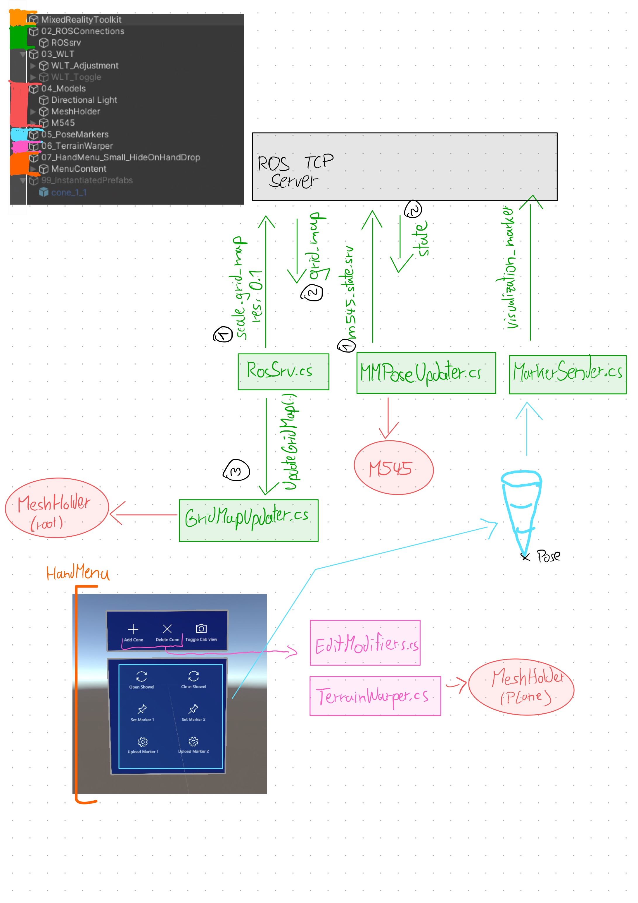

**This is the client part of a larger project. The remaining documentation can be found here: https://github.com/Yoekkul/Docs-MR-remote-for-HEAP**

# HoloPlanner Unity client
⚠️ The project is located within the `HoloLight` Unity scene (the other scenes are kept as personal reminder of the path taken to reach the final version).

⚠️ Due to a bug in Microsofts WLT this project must be located in a root directory (Such as \C or \D)

---

The objects within the scene are setup with the following hierarchy:
* MixedRealityToolkit: Used to setup [Microsofts MRTK](https://docs.microsoft.com/en-us/windows/mixed-reality/mrtk-unity/mrtk2/?view=mrtkunity-2022-05). This handles the MR headset
* 02_ROSConnections: Sends and receives messages from ROS
* 03_WLT: Aligns the virtual and physical scene throught the use of QR codes on the excavator
* 04_Models: Holds the models for the excavator and the terrain
* 05_PoseMarkers: Contains two markers, which serve as target positions when moving the excavator showel via Inverse Kinematics
* 07_HandMenu: The menu appears next to the raised hand (palm towards the user). It allows setting the Pose Markers, Toggling the visibility of the cab and Setting mesh-editing nodes.
* 99_InstantiatedPrefabs: This contains prefabs which have values already instantiated. (Used to set the markers for terrasin editing)

# Program Diagram

# Sections in depth
### 02_ROSConnections
To communicate with the machine we use two ROS services:
- **RosSrv.cs:** `scale_grid_map` ((float) resolution)-> ((GridMap) map)
- **MMPoseUpdater.cs** `"m545_state_srv` ()->((M545StateMsg) state)

`GridMapUpdater.cs` receives the updated map data from  `RosSrv.cs`. At the first message exchange, or whenever the resolution changes it procedurally creates a
new mesh. This mesh is then updated with the heights extracted from the received Grid_Map message.

To send the showel's target position we use a message:
- **MarkerSender.cs:**  `visualization_marker` ((MarkerMsg) marker)

The markers can be set by the user through the hand menu labelled as 'Set Marker 1' and 'Set Marker 2', which can be seen in the middle row of the Hand menu. Only when the user selects the 'Upload marker 1/2' option the program checks that the user is further away than an arbitrary "safety radius" from the set point and from the machine, if this condition is satisfiedthe position gets sent as a MarkerMsg to ROS. Users should ALWAYS be careful when standing close to the machine, the safety radius does NOT guarantee safety!

This funcion has not yet been tested, and lacks the implementation of the IK-based movement of the machine.

### 03_WLT
**This section requires the first major rework**

Currently to align the virtual scene with the physical world Microsofts World locking tools framework is used. More specifically the [QR Space Pins sample](https://microsoft.github.io/MixedReality-WorldLockingTools-Samples/Advanced/QRSpacePins/QRSpacePins.html) is taken as starting point.
This has the major drawback that the location of the QR codes is assumed to be static. To make it work the `QRPlacer.cs` script, located in the 03_WLT GameObject ensures that the transform of the QR codes (called QRloc_x, where x is an intiger) is moved to the current excavators position and rotation, before enabling the WLT_Toggle GameObject, which starts the whole WLT process.

This is neither the simplest nor the best solution to the problem of alligning virtual and physical, but it works.

### 04_Models
Contains the models visible in the scene:
- `MeshHolder` contains:
  * `Root`: this is used to anchor different transformations 
  * `Plane`: This holds a transparent mesh which can get altered by nodes set by the user (in the top row of the hand menu). The plane gets shifted by `TerrainWarper.cs`, as discussed in section 06
  * MeshHolder has the mesh which gets parametrically set by `GridMapUpdater.cs`, as discussed in section 02
- `M545` contains the Mesh of the machine. It was procedurally constructed through [Unity's URDF importer](https://github.com/Unity-Technologies/URDF-Importer). The pieces are moved via the `MMPoseUpdater.cs` script and have been manually addressed by name in that script.

### 05_PoseMarkers
Contains two pose markers, which can be initially spawned (made active in front of the player) from the hand menu. The markers are inverted cones and their tip sits at the locaiton of the marker. An user can easily take and move them around the space.

### 06_TerrainWarper
`EditModifiers.cs` enables the different options in the hand menu. Through it Create/Delete mode are toggled, and the associated logic is handled.

`TerrainWarper.cs` takes the original mesh and Modifies it based on the positon of the editing nodes. It contains quite a few bugs and is quite unflexible (It has problems when markers are too far from the terrain, it only supports conical fixed angle edits, ...)

**This section is at the second highest priority for a rework**

### 07_HandMenu
Contains the hand menu, which appears when a user raises their palm, facing themselves.

### 99_InstantiatedPrefabs
This sections contains Prefabs which have been instantiated with references to other GameObjects in the scene.
`cone_1_1` is such as object. It is used as an editing node, and it has its OnManipulationStarted and OnManipulationEnded Events assigned to the `TerrainWarper.cs` script discussed in section 06.
